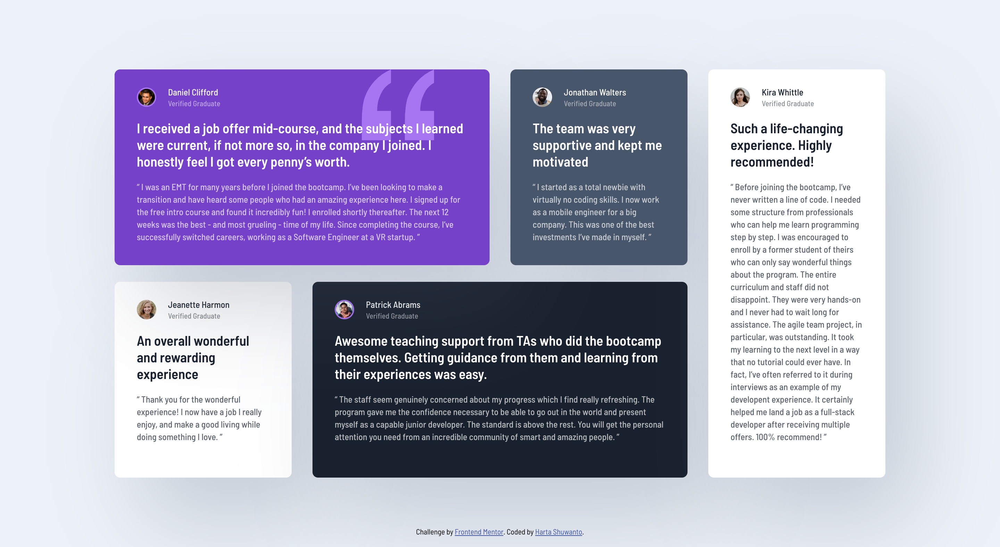

# Frontend Mentor - Testimonials grid section solution

This is a solution to the [Testimonials grid section challenge on Frontend Mentor](https://www.frontendmentor.io/challenges/testimonials-grid-section-Nnw6J7Un7). Frontend Mentor challenges help you improve your coding skills by building realistic projects. 

## Table of contents

- [Overview](#overview)
  - [The challenge](#the-challenge)
  - [Screenshot](#screenshot)
  - [Links](#links)
- [My process](#my-process)
  - [Built with](#built-with)
  - [What I learned](#what-i-learned)
  - [Continued development](#continued-development)
  - [Useful resources](#useful-resources)
- [Author](#author)
- [Acknowledgments](#acknowledgments)

## Overview

### The challenge

Users should be able to:

- View the optimal layout for the site depending on their device's screen size

### Screenshot

### Links

- Solution URL: [GitHub](https://github.com/hartashu/testimonials-grid-section)
- Live Site URL: [GitHub Pages](https://hartashu.github.io/testimonials-grid-section)

## My process

### Built with

- Semantic HTML5 markup
- CSS custom properties
- Flexbox
- CSS Grid
- Mobile-first workflow
- BEM naming convention

### What I learned

- Responsive web design
- Flexbox
- CSS grid

### Continued development

- Responsive web design
- Semantics HTML and accessibility
- Use BEM naming convention more efficiently
- Make a proper utility classes in CSS
- Make a modular, sustain, and maintain-able code to work with a team
- Giving CSS class a proper name

### Useful resources

Here I listed all resources I learned from through out my journey.

Getting started with HTML & CSS:
- [HTML & CSS Course by SuperSimpleDev](https://youtu.be/G3e-cpL7ofc?si=4xxA1hw_5mU_9-aX)

Git & GitHub:
- [Git & GitHub Tutorial by SuperSimpleDev](https://youtu.be/hrTQipWp6co?si=HIO_1gWZHOGBGxDH)

CSS:
- [CSS Units](https://youtu.be/-GR52czEd-0?si=qHL5x0IH4GpsBNtq)
- [CSS Transform](https://youtu.be/rzD-cPhq02E?si=MpCFcO-d6k9C4QKo)
- [The difference between max-inline-size and max-width property](https://css-tricks.com/almanac/properties/m/max-inline-size/)
- [CSS Reset](https://www.joshwcomeau.com/css/custom-css-reset/)
- [Checking alt attribute](https://www.kevinpowell.co/article/a-cool-trick-for-checking-for-alt-attribute/)
- [Pseudo Elements ::after ::before](https://youtu.be/OtBpgtqrjyo?si=2codHb-Km9fPA6fF)
- [Gap After The List Marker](https://css-tricks.com/everything-you-need-to-know-about-the-gap-after-the-list-marker/)
- [Styling HTML Table with CSS](https://youtu.be/biI9OFH6Nmg?si=XzuXiAL7lfvz0CFr)
- [min() max() clamp()](https://www.youtube.com/watch?v=U9VF-4euyRo)
- [The Picture Element](https://web.dev/learn/design/picture-element)

BEM (Block Element Modifier):
- [Introduction to BEM](https://getbem.com/introduction/)
- [BEM 101](https://css-tricks.com/bem-101/)
- [BEM by Kevin Powell](https://youtu.be/SLjHSVwXYq4?si=owKeN-KRLNifBy99)
- [BEM by Varvara from Yandex](https://www.smashingmagazine.com/2012/04/a-new-front-end-methodology-bem/#comments-a-new-front-end-methodology-bem)
- [BEM by Dmitry Mayorov](https://youtu.be/YktyUS1Aeo0?si=ompbeUgOETzVQQfi)
- [BEM by ByteGrad](https://youtu.be/N1TYlM0GA5E?si=1O5rcY3AEgqLvQch)
- [Battling BEM CSS: 10 Common Problems And How To Avoid Them](https://www.smashingmagazine.com/2016/06/battling-bem-extended-edition-common-problems-and-how-to-avoid-them/)
- [How to translate a design into HTML — Part 1: Product Preview Card](https://fedmentor.dev/posts/html-plan-product-preview/#card-title)

Responsive Web Design (RWB):
- [Responsive Web Design](https://developer.mozilla.org/en-US/docs/Learn/CSS/CSS_layout/Responsive_Design)
- [Responsive layout by Kevin Powell](https://courses.kevinpowell.co/conquering-responsive-layouts)
- [The 100% correct way to do CSS breakpoints](https://www.freecodecamp.org/news/the-100-correct-way-to-do-css-breakpoints-88d6a5ba1862/)

Layout:
- [Understanding Layout Algorithms](https://www.joshwcomeau.com/css/understanding-layout-algorithms/)
- [Full-Bleed Layout Using CSS Grid](https://www.joshwcomeau.com/css/full-bleed/)
- [An Interactive Guide to Flexbox](https://www.joshwcomeau.com/css/interactive-guide-to-flexbox/)
- [An Interactive Guide to CSS Grid](https://www.joshwcomeau.com/css/interactive-guide-to-grid/)

Semantics:
- [HTML Semantics Cheat Sheet](https://learntheweb.courses/topics/html-semantics-cheat-sheet/)
- [Why You Should Choose HTML5 article Over section](https://www.smashingmagazine.com/2020/01/html5-article-section/#:~:text=Combining%20with%20HTML5%20microdata,value%20of%20its%20itemprop%20attribute.)

## Author

- GitHub - [hartashu](https://github.com/hartashu)
- Frontend Mentor - [@hartashu](https://www.frontendmentor.io/profile/hartashu)

## Acknowledgments

Thanks to everyone who kindly and heartedly share knowledges all over the internet.